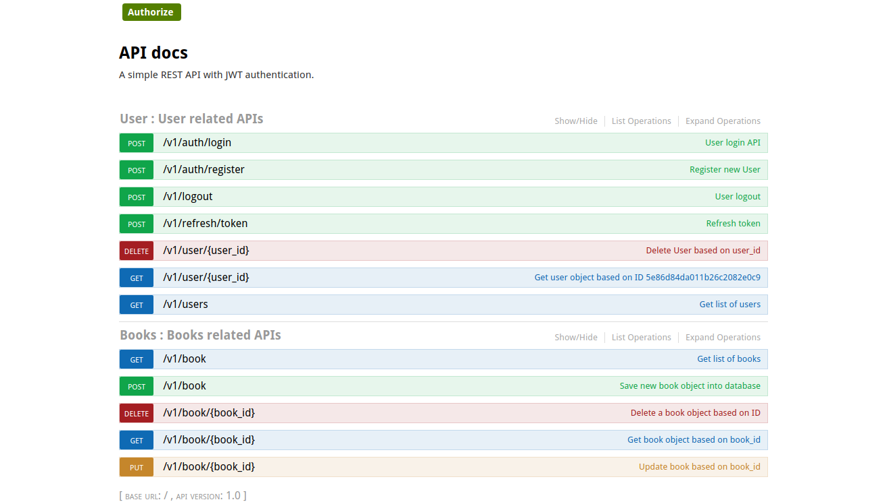

#### Flask + MySQL + REST API + Authentication

##### Screenshot



```sh
$ python -V
Python 3.7.4
```

##### Setup
- Git clone <project_url>
<!-- - Install `sudo apt-get install libmysqlclient-dev` since `flask-mysqldb` package will be expecting mysql_config -->
- install requirements `pip install -r requirements.txt`
- Run DB migrations after updating the MySQL db details at `main/db_config.py`
- `export FLASK_ENV=development` in Linux and use `set` in windows
- execute `flask run` to run the application


##### Features
1. User registration & Login
2. Token (JWT) based API calls
3. User delete
4. Get user profile
5. Delete user


```sh
# To see the no. of connections opened in MongoDB
db.serverStatus().connections
```